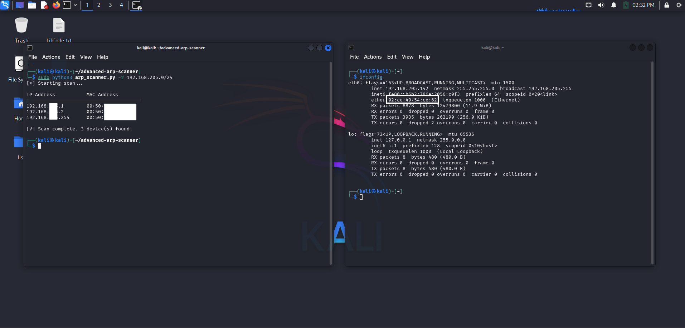
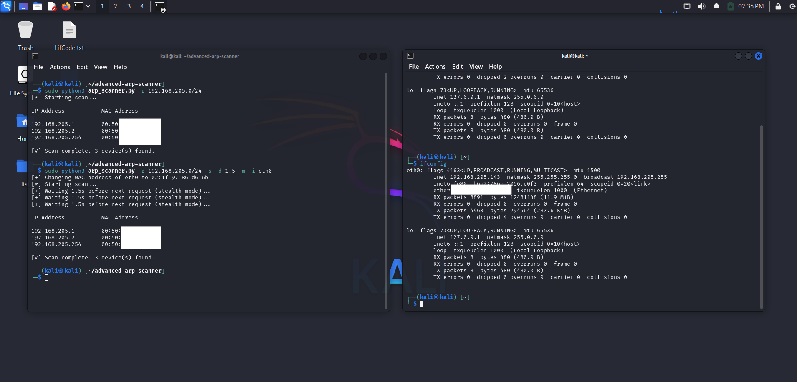

# 🕵️ Advanced ARP Scanner

A professional-grade ARP network scanner built in Python using Scapy.  
Supports stealth scanning and automatic MAC spoofing.

---

## 📸 Screenshots

> Here are some example screenshots from the tool in action:

### 🖥️ Terminal Output (Stealth Scan)



### 🖥️ MAC Spoof + Stealth Scan




---

## 🚀 Features

- ARP scanning for network discovery
- Stealth mode (custom or random delays)
- MAC spoofing before scan
- Clean CLI interface with short options

---

## 🛠️ Installation

```bash
git clone https://github.com/MRX2424/advanced-arp-scanner.git
cd advanced-arp-scanner
pip install -r requirements.txt


## 📦 Usage

### Basic Scan
```bash
python3 arp_scanner.py -r 192.168.1.1/24


### Stealth Scan
```bash
python3 arp_scanner.py -r 192.168.1.1/24 -s -d random

### MAC Spoofing
```bash 
sudo python3 arp_scanner.py -r 192.168.1.1/24 -s -d 1.5 -m -i eth0

